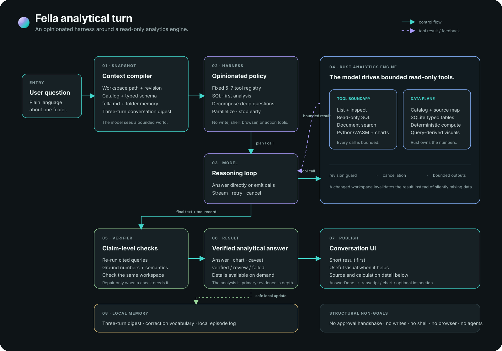

# Fella architecture

This is the current implementation reference for the Electron desktop app and
its Rust analytics runtime. Update it when a code change alters a boundary or
data flow. The Rust backend lives in `backend/` and runs as an Electron-managed
sidecar; the app does not use Tauri.

## System at a glance

```text
Svelte renderer
   │ typed, allowlisted API
   ▼
Electron preload ── Electron main
                         │ dialogs, window, updater
                         │ correlated JSON-lines requests/events
                         ▼
                   Rust sidecar
                    ├─ model-directed conversation runtime
                    ├─ local workspace catalog and context
                    ├─ read-only SQL / sandboxed Python / document tools
                    ├─ evidence, verification, and turn persistence
                    └─ selected model provider (network)
```



| Layer | Responsibility | Main code |
| --- | --- | --- |
| Svelte UI | Conversation, clarification controls, charts, evidence details, settings, and workspace views | `src/routes/`, `src/lib/` |
| Electron | Window and native dialogs, safe external links, updater, typed preload API, and Rust process lifecycle | `electron/main.mjs`, `electron/preload.cjs`, `electron/engine.mjs` |
| Bridge | Correlated newline-delimited requests and streamed events between Electron and Rust | `backend/src/stdio.rs`, `src/lib/ipc.ts` |
| Harness | Model calls, context assembly, tool orchestration, clarification/resume, and canonical turn trace | `backend/src/engine/agent.rs`, `runtime.rs`, `context.rs` |
| Workspace model | Catalog, revision, source profiles, semantic hints, and grounding | `catalog.rs`, `workspace_model.rs`, `grounding.rs` |
| Analytical engine | Ingestion, SQL, Python execution, charts, and verification; does not call the model | `engine/analytics/`, `engine/ingest/` |
| Local persistence | Settings, provider credentials, source metadata, conversation and analysis records, and scoped memory | `sqlite.rs`, `secrets.rs`, `analysis_store.rs`, `memory.rs`, `semantic_memory.rs` |

Electron's renderer is sandboxed and has no Node or direct filesystem access.
The Rust process reads only the workspace selected by the user through its
catalog and bounded operations. The selected model provider receives the
prompt and any context or tool results used in the answer; Fella does not
proxy that request through a Fella service.

## The analytical turn

Fella is one model-directed loop, not a deterministic router followed by a
separate agent. A turn typically follows this shape, but may skip or repeat
steps when the question and observations allow:

1. **Assemble relevant context.** Include the current workspace revision and
   compact source profiles when mounted, applicable user context, bounded
   conversation history, and relevant prior analysis. Context preserves
   provenance; it is not itself proof of a new data claim.
2. **Interpret and investigate.** The model can answer from model knowledge,
   inspect files and tables, read/search documents, propose an analytical
   interpretation, or ask for a material user decision. There is no workspace
   requirement for a general question.
3. **Compute with the suitable route.** The model may use read-only SQL,
   sandboxed Python, document evidence, and charts. Python is not a fallback;
   it is appropriate for statistical or multi-stage calculations. A grounded
   compiler can help with supported plans, while direct model-selected tools
   remain available when it cannot express the analysis.
4. **Review and repair locally.** The runtime checks execution and evidence,
   attaches findings to the specific claim, evidence, or artifact they affect,
   and allows bounded repair. If one chart is invalid, that does not by itself
   discard an unrelated supported result.
5. **Persist and present.** The Rust runtime owns the typed analysis record;
   the UI projects its answer, clarification, chart, and progressively
   disclosed details. A clarification response resumes the same logical
   analysis, with prior evidence usable only when its source revision remains
   current.

An optional `__analysis_contract` function lets the model state semantic
mappings, scope, measures, and assumptions. It does not access data or grant
permission. `__request_clarification` is a separate control-flow action that
replaces the composer with a question and selectable choices plus free text;
it is not evidence or a substitute for reasonable inspection. When the model
requests new observations and a dependent calculation together, the runtime
returns the observations first so the model can use them before computing.

The model drives interpretation and tool choice. Rust owns file scope,
permissions, resource limits, deterministic execution, lifecycle, persistence,
and the consequences of verification findings. The verifier is not an oracle
for user intent: an executed and replayable query can still answer the wrong
question. Its typed findings are target-scoped; only an explicit answer-level
integrity failure such as a changed workspace revision blocks the whole turn.
The user can inspect details without seeing a pass/fail badge repeated under
every message.

## Workspace and analysis data

`catalog.rs` walks the selected folder, applies `.fellaignore`, classifies
supported and unsupported paths, and assigns workspace-relative source names.
The catalog and prepared data are revision-bound. Replacing a workspace
publishes a complete new snapshot atomically; in-flight analysis holds the
revision it started with.

The shipped data engine is bundled SQLite. CSV/TSV, JSON/NDJSON, and supported
spreadsheet sheets are normalized into a local analytical database. Text,
Markdown, logs, and extractable-text PDFs are read as documents, not turned
into tables; document lookup is lexical search plus bounded reads, not an
embedding index. OCR and arbitrary document formats are not supported.

DuckDB is an optional Cargo feature for custom builds, not the default release
or CI backend. It is not an automatic fallback. The default build includes
PDF and Excel ingestion. Exact supported extensions and limits are maintained
in the public [getting-started guide](site/getting-started.mdx) and at the
catalog/ingestion code boundary.

### Analysis tools

The fixed workspace surface includes file listing, table inspection,
single-statement read-only SQL, document search/read, a bounded Python
environment, and validated chart production. Prior-turn evidence may also be
made available when a same-conversation follow-up can safely reuse it. The
registry can disable capability groups, and the engine enforces the same
policy at execution boundaries.

`run_python` uses an embedded RustPython guest compiled to
`wasm32-unknown-unknown`, executed by Wasmi. The guest has no filesystem,
network, environment, or subprocess access. A narrow host bridge captures
output and provides bounded read-only SQL results. There is no package
installer, pandas, NumPy, or SciPy; small analytics helpers are provided by
Fella. Resource limits and the current execution boundary are documented in
the root [security policy](../SECURITY.md).

Charts are structured data, not generated HTML or SVG. A chart can use an
exact SQL result or an explicitly published Python result. Rendering, source
reconciliation, and verification are separate concerns; a visually rendered
chart is not automatically a semantically correct chart.

## Context, continuity, and evidence

- **Conversation history** resolves references and follow-ups. Prior assistant
  prose is context, not evidence for a new factual claim.
- **`fella.md`** is user-authored workspace guidance. It is separate from
  source data and editable only through an explicit user action.
- **Semantic memory** is local and workspace-scoped. User-confirmed facts and
  revision-valid observations may inform later interpretation; model
  suggestions do not silently become authoritative definitions.
- **Analysis records** retain the question, workspace revision, interpretation
  where present, execution trace, verification report, provenance, and result.
  Explicit reruns are linked to the original turn and execute against the
  currently mounted matching workspace.
- **Evidence** identifies the source and computation behind an answer. It
  helps a person inspect the work; it does not guarantee that a semantic
  choice matched their intent.

The primary implementation is in `context.rs`, `memory.rs`,
`semantic_memory.rs`, `analysis_store.rs`, and `evidence.rs`.

## Network and trust boundaries

- Model traffic goes directly from the Rust sidecar to the provider selected
  by the user. Prompts and selected context/tool results may include workspace
  content. Provider retention and training are governed by that provider.
- No web search or page-fetch route is shipped. The inert `/mcp` command does
  not connect to anything or add tools.
- Workspace operations are read-only. There is no agent tool for writing,
  moving, or deleting source files. Editing `fella.md` is an explicit UI action.
- Provider keys are stored in `auth.json` in the application-data directory,
  separate from the settings database and transcript.
- `/update` is user-triggered in packaged builds. The Python guest has no
  network capability.

See [Security](../SECURITY.md) for the user-facing guarantees and their limits,
[Product](PRODUCT.md) for the scope, and [Testing](TESTING.md) for what the
current checks establish.
